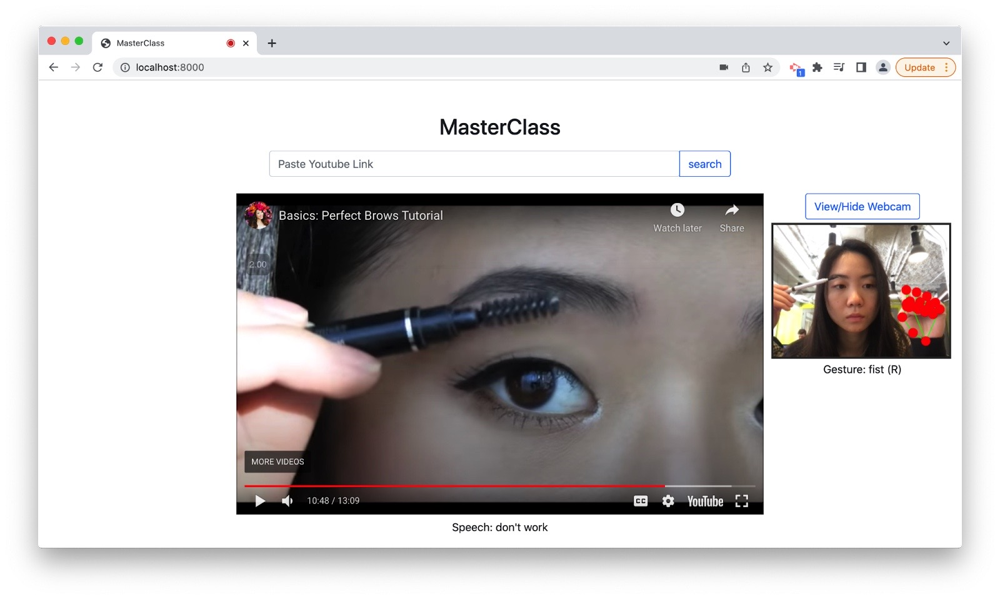

# master-class
6.835 Final Project

We propose and implement a system called MasterClass, which enables users to manipulate Youtube videos with voice and gesture commands. Our system supports eight gesture commands and over twenty voice commands to play or pause the video, change the volume or speed, skip or rewind, and jump to different timestamps. We utilize the HandPose ML model and the FingerPose library for Gesture Recognition and the WebSpeech API for Speech Recognition. The final product is a web app that allows users to learn new skills from a YouTube video without being at the laptop.

Requirements: Chrome Browser, Laptop, Webcam, Microphone.

To run,
1. Type 
``python -m http.server`` in the command line.
2. Go to localhost:8000 on Chrome

Code:
- index.html is the website backbone
- css is where the CSS for UI is found
- app/gestures.js is for gesture recognition is for FingerPose running inference
- app/hands.js is for HandPose running inference
- app/setupSpeech.js is for setting up WebSpeech API
- app/speech.js is for activating speech commands
- app/youtube.js is for embedding the YouTube video

